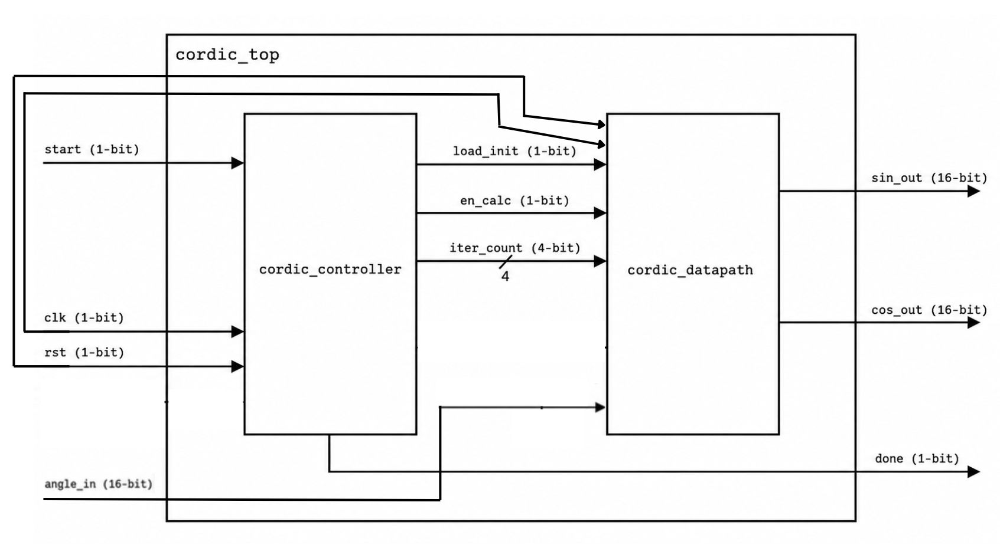
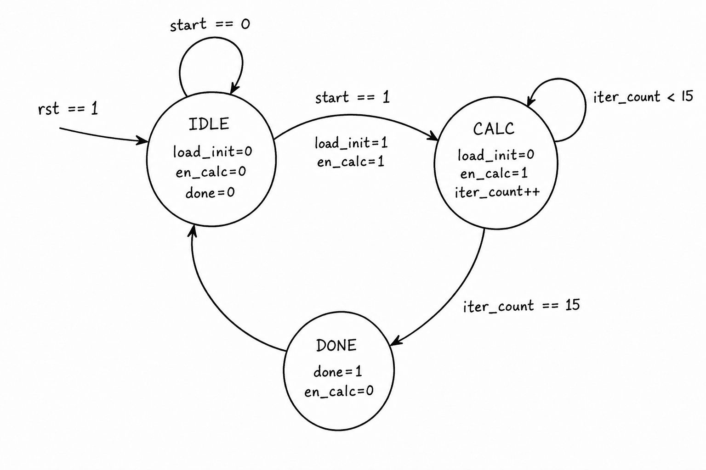
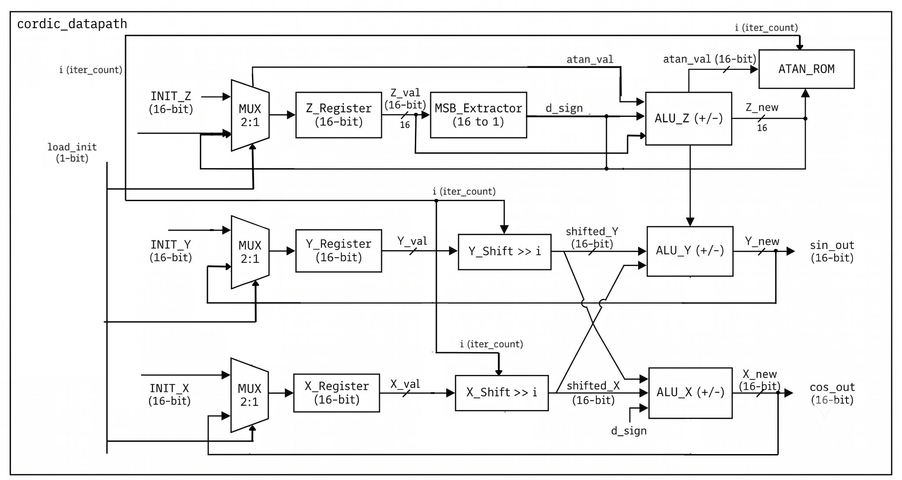

# CORDIC Accelerator


[]()
[]() 

A hardware implementation of the **CORDIC (Coordinate Rotation Digital Computer)** algorithm written in **SystemVerilog**. This project computes **sine** and **cosine** values using an **iterative shift-add architecture**, avoiding hardware multipliers by relying solely on additions, subtractions, arithmetic shifts, and a lookup table of precomputed arctangent constants.

---

# Features

- 16-bit fixed-point implementation
- Iterative CORDIC rotation mode
- Moore FSM based controller
- Dedicated ATAN lookup ROM
- Self-checking SystemVerilog testbench
- Makefile for automated compilation and simulation

---

# Repository Structure

```
cordic-accelerator/
│
├── design/
│   ├── cordic_controller.jpg
│   ├── cordic_datapath.jpg
│   └── cordic_top.jpg
│
├── src/
│   ├── atan_val.sv
│   ├── cordic_controller.sv
│   ├── cordic_datapath.sv
│   └── cordic_top.sv
│
├── testbench/
│   └── cordic_top_tb.sv
│
├── Makefile
├── README.md
└── .gitignore
```

---

# Project Overview

The CORDIC algorithm computes trigonometric functions using only:

- Addition
- Subtraction
- Arithmetic right shifts
- Precomputed arctangent constants

Instead of expensive multipliers, each iteration performs a micro-rotation that gradually rotates a vector toward the desired input angle.

The implementation uses **16 iterations**, producing 16-bit fixed-point sine and cosine outputs.

---

# Architecture

The design is divided into two primary hardware blocks:

- **Controller (FSM)**
- **Datapath**

The controller generates the required control signals, while the datapath performs the CORDIC computations.

---

# Top-Level Architecture

<p align="center">

</p>

The top module connects the controller and datapath.

Inputs:

- Clock
- Reset
- Start
- Input angle

Outputs:

- Cosine
- Sine
- Done signal

---

# Controller FSM

<p align="center">

</p>

The controller operates through four states:

| State | Description |
|--------|-------------|
| **IDLE** | Waits for the `start` signal |
| **INIT** | Loads the initial CORDIC values |
| **CALC** | Executes one CORDIC iteration every clock cycle |
| **DONE** | Raises `done` before returning to IDLE |

The controller also maintains the iteration counter used by the datapath.

---

# Datapath

<p align="center">

</p>

The datapath contains:

- X register
- Y register
- Z register
- Arithmetic shifters
- Add/Subtract ALUs
- Sign extraction logic
- ATAN lookup ROM

Each clock cycle performs one CORDIC iteration according to the sign of the current residual angle.

---

# Fixed-Point Representation

The implementation uses signed **16-bit fixed-point values**.

The datapath initializes the CORDIC gain-compensated vector using:

```
INIT_X = 16'h26DD
INIT_Y = 16'h0000
```

The input angle is provided in fixed-point format and is iteratively reduced to zero while rotating the vector.

---

# Verification

A self-checking SystemVerilog testbench verifies the implementation.

Current test vectors include:

| Angle | Expected Output |
|--------|-----------------|
| 0° | cos = 1, sin = 0 |
| 45° | cos ≈ 0.707, sin ≈ 0.707 |
| 90° | cos = 0, sin = 1 |

The testbench automatically compares the generated outputs against expected values with a small tolerance.

---

# Building and Running

## Requirements

- Icarus Verilog
- GNU Make

Compile and run:

```bash
make
```

Compile only:

```bash
make compile
```

Run simulation:

```bash
make run
```

Remove generated files:

```bash
make clean
```

Display available targets:

```bash
make help
```

---

# Simulation Flow

```
Reset
   │
   ▼
IDLE
   │
start
   ▼
INIT
   │
   ▼
16 CORDIC Iterations
   │
   ▼
DONE
```

---

# References

- EE Times CORDIC Tutorial
- ZipCPU CORDIC Guide
- Ray Andraka – A Survey of CORDIC Algorithms for FPGA Based Computers